# Enterprise Retrieval-Augmented Generation (RAG) Pipeline on Azure
**Scale: 10,000 PDFs per day**

This architecture is a batch and event-driven pipeline designed on Microsoft Azure to reliably extract, chunk, embed, and index 10,000 PDFs daily for Retrieval-Augmented Generation (RAG).

---

## 1. Ingestion Layer
* **Azure Blob Storage**: Serves as the primary object store (landing container) where raw PDFs are uploaded.
* **Azure Cosmos DB or Azure SQL Database**: Immediately stores document-level metadata (`doc_id`, `source`, `upload_time`, and `checksum SHA-256`) to maintain an ingestion record before heavy processing.

## 2. Orchestration & Scaling
* **Orchestrator Options**:
  * **Azure Durable Functions**: Best for code-first, stateful event-driven workflows that track long-running tasks.
  * **Azure Data Factory (ADF)**: Ideal for scheduled, enterprise-grade ETL/ELT batch orchestration.
  * **Azure Logic Apps**: Useful for quick low-code connections to third-party sources.
* **Buffering**: **Azure Service Bus Queue** or **Azure Queue Storage** receives micro-batches (100–200 document IDs) to decouple ingestion from processing and smooth out load spikes.
* **Worker Execution**:
  * **Azure Functions**: Auto-scales based on queue depth for lightweight processing.
  * **Azure Container Apps / AKS**: Best for heavy compute workloads, complex dependencies (like custom Python OCR libraries), or GPU acceleration.

## 3. PDF Processing
* **Text & Layout Extraction**:
  * **Azure AI Document Intelligence** (formerly Form Recognizer): Managed service providing OCR, layout detection, table extraction, and fallbacks for scanned PDFs.
  * **Custom Python Libraries**: Running `pdfplumber`, `PyPDF`, or `Apache Tika` on containerized workers for standard digital PDFs to optimize costs.
* **Normalization & Chunking**: Cleans text (stripping headers, footers, page numbers, and bad encodings) and partitions content into semantic or fixed-token chunks.

## 4. Deduplication Strategy
* **Document-Level**: Checks the SHA-256 hash of incoming PDFs against Cosmos DB/SQL DB. If matched, processing skips immediately.
* **Chunk-Level**: Hashes normalized text chunks and verifies them against the metadata store prior to calling embedding models, avoiding redundant vector embedding API costs.

## 5. Embedding & Indexing
* **Embedding Generation**: **Azure OpenAI Service** generates vector embeddings via models like `text-embedding-3-small` or `text-embedding-3-large`. Alternatively, self-hosted Hugging Face models can be used for cost-sensitive or privacy-focused deployments.
* **Vector & Metadata Stores**:
  * **Azure AI Search**: Fully managed search engine providing hybrid search (vector + BM25 keyword search), semantic ranking, and built-in vector indexing.
  * **Azure Cosmos DB (Vector Search)** or **Azure Database for PostgreSQL (with `pgvector`)**: Stores raw chunk text alongside metadata and vector embeddings in a single database.

## 6. Failure Handling & State Management
* **State Tracking**: **Cosmos DB** or **Azure SQL** tracks the lifecycle state (`INGESTED` $\rightarrow$ `PROCESSED` $\rightarrow$ `EMBEDDED` $\rightarrow$ `INDEXED`). If a worker fails, the job resumes from the last successful state rather than restarting from scratch.
* **Dead-Letter Queue (DLQ)**: **Azure Service Bus DLQ** catches permanently failed messages (corrupt PDFs, malformed text, max retry limits reached) for manual inspection.
* **Retries**: Built-in exponential backoff handles transient API rate limits (e.g., Azure OpenAI $429$ Too Many Requests) and brief network outages.

## 7. Monitoring & Observability
* **Application Insights & Azure Monitor**: Collects distributed traces using `doc_id` to track end-to-end latency across functions, containers, and database calls.
* **Log Analytics & Dashboards**: Tracks operational metrics such as PDFs processed per hour, duplicate hit rates, DLQ count, and embedding token costs.
* **Alerts**: Fires automated notifications (via Action Groups / Slack / Email) if processing falls below SLA thresholds or failure rates spike above predefined limits.

---

## Architecture Diagram

```mermaid
flowchart LR
    A[PDF Uploads] --> B[Azure Blob Storage]
    B --> C[Metadata Store\nAzure Cosmos DB / Azure SQL]
    C --> D[Orchestrator\nAzure Durable Functions / ADF / Logic Apps]
    D --> E[Service Bus Queue\nMicro-batches: 100-200 docs]
    E --> F[Worker Layer\nAzure Functions / Container Apps / AKS]
    F --> G[PDF Processing\nDocument Intelligence + Python Libraries]
    G --> H[Normalization & Chunking]
    H --> I{Deduplication\nDocument + Chunk Hash Check}

    I -->|Duplicate| J[Skip Processing]
    I -->|New| K[Embedding Service\nAzure OpenAI / Hugging Face]
    K --> L[Vector Store\nAzure AI Search / Cosmos DB Vector / PostgreSQL pgvector]
    L --> M[Indexed Knowledge Base]

    F --> N[State Tracking\nCosmos DB / Azure SQL\nINGESTED -> PROCESSED -> EMBEDDED -> INDEXED]
    E --> O[DLQ\nDead Letter Queue]
    F --> P[Monitoring\nApplication Insights / Azure Monitor / Log Analytics]
    P --> Q[Alerts\nAction Groups / Slack / Email]

    style A fill:#e3f2fd,stroke:#1e88e5,stroke-width:2px
    style B fill:#e8f5e9,stroke:#43a047,stroke-width:2px
    style C fill:#fff3e0,stroke:#fb8c00,stroke-width:2px
    style D fill:#f3e5f5,stroke:#8e24aa,stroke-width:2px
    style E fill:#fce4ec,stroke:#d81b60,stroke-width:2px
    style F fill:#ede7f6,stroke:#5e35b1,stroke-width:2px
    style G fill:#e0f2f1,stroke:#00897b,stroke-width:2px
    style H fill:#e0f7fa,stroke:#00acc1,stroke-width:2px
    style K fill:#fff8e1,stroke:#f9a825,stroke-width:2px
    style L fill:#f1f8e9,stroke:#7cb342,stroke-width:2px
    style M fill:#f9fbe7,stroke:#c0ca33,stroke-width:2px
    style N fill:#fbe9e7,stroke:#e64a19,stroke-width:2px
    style O fill:#efebe9,stroke:#6d4c41,stroke-width:2px
    style P fill:#e1f5fe,stroke:#039be5,stroke-width:2px
    style Q fill:#fce4ec,stroke:#c2185b,stroke-width:2px
```

### Architecture Flow Summary
1. Raw PDFs are uploaded to Azure Blob Storage.
2. Document metadata is recorded in Cosmos DB or Azure SQL.
3. An orchestrator schedules and triggers workers.
4. Jobs are buffered into Service Bus for micro-batch processing.
5. PDFs are OCR’d, normalized, and chunked.
6. Duplicate documents/chunks are filtered before embedding.
7. Chunks are embedded using Azure OpenAI or self-hosted models.
8. Vectors are stored in Azure AI Search or a vector-enabled database.
9. State is tracked across the full lifecycle and recoverable retries are managed.
10. Monitoring and alerts support operational health and SLA compliance.

---

### Key Azure Services Used
- Azure Blob Storage
- Azure Cosmos DB / Azure SQL
- Azure Durable Functions / ADF / Logic Apps
- Azure Service Bus Queue / DLQ
- Azure Functions / Container Apps / AKS
- Azure AI Document Intelligence
- Azure OpenAI Service
- Azure AI Search
- Azure Monitor / Application Insights
- Log Analytics
